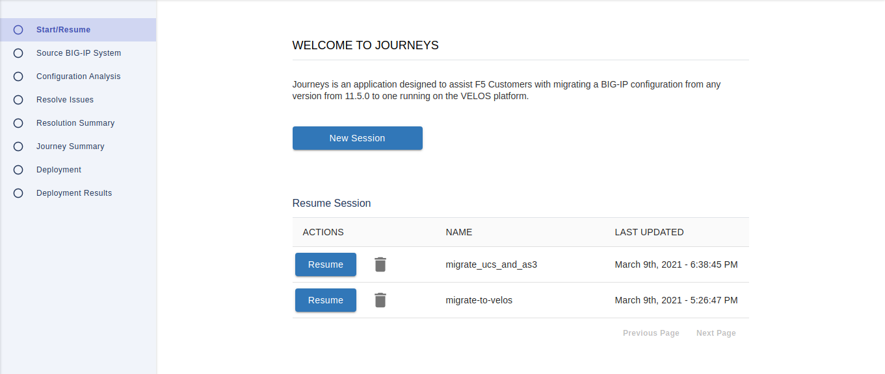
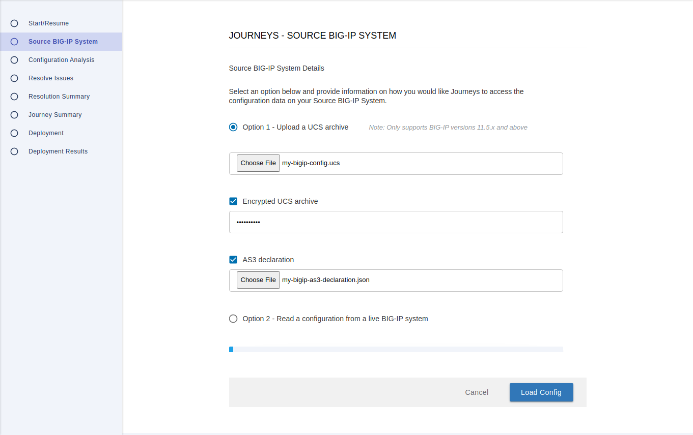
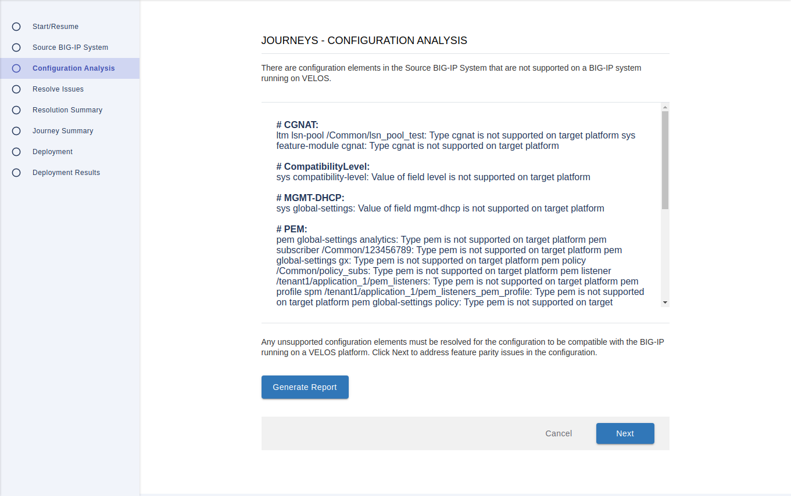
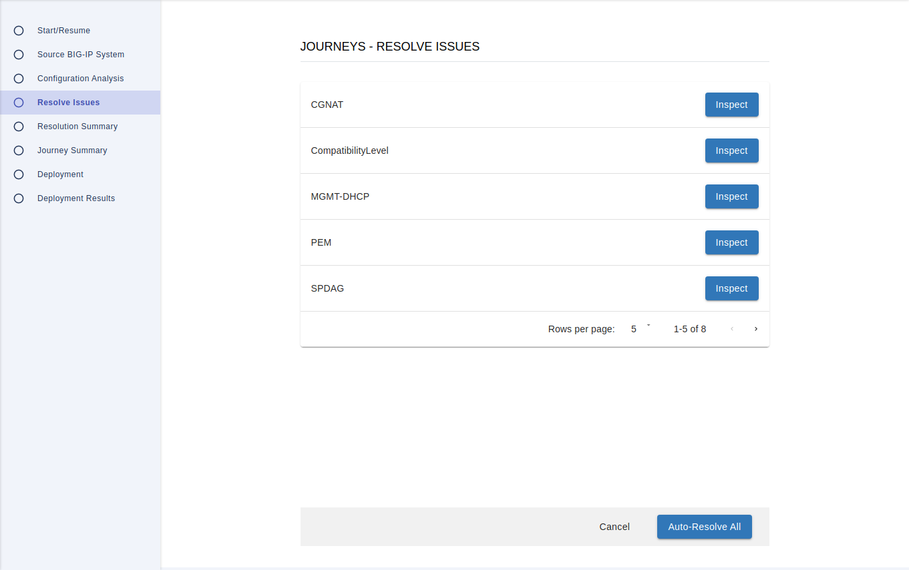
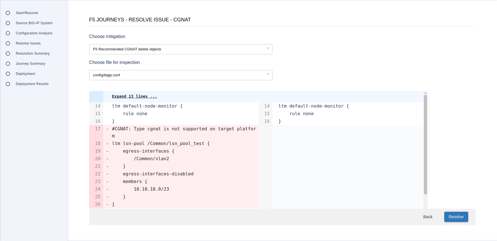
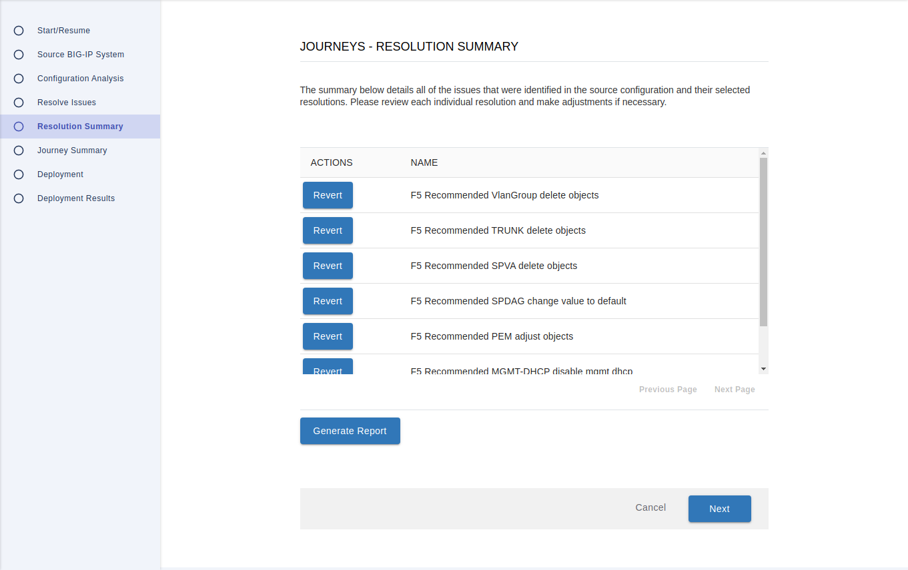
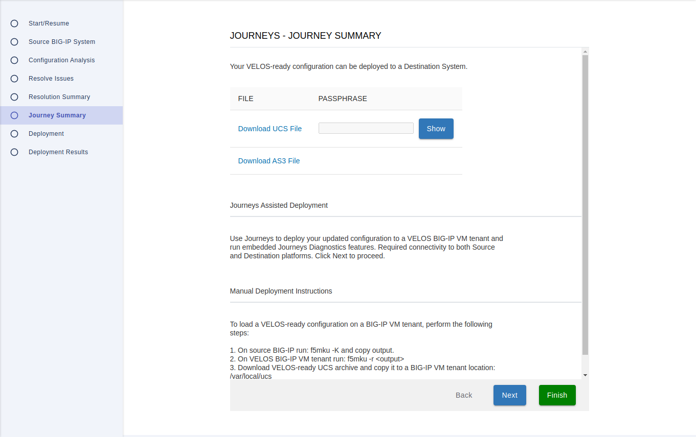

# Journeys - BIG-IP assisted journeys

----
## Contents:
- [Description](#description)
- [Prerequisites](#big-ip-prerequisites)
- [Configuration migration considerations](#configuration-migration-considerations)
- [Requirements](#journeys-setup-requirements)
- [Usage](#usage)
- [Contributing](#contributing)

----
## Description
Journeys is an application designed to assist F5 Customers with migrating a BIG-IP configuration to a new F5 device and enable new ways of migrating.

Supported journeys:
+ Migration to VELOS - migrating a BIG-IP configuration from any version from 11.5.0 to one running on the VELOS platform
+ Per-App migration - migrating mission critical Applications and their dependencies to a new AS3 configuration and deploying it to a BIG-IP instance of choice. See [perapp documentation](PERAPP.md) for more details.
+ Non-VELOS migration - migrating a BIG-IP configuration to a new non-VELOS platform, e.g. iSeries (coming soon)

## Journey: Migration to VELOS
Supported features:
+ UCS or UCS+AS3 source configurations
+ Flagging source configuration feature parity gaps and fixing them with provided built-in solutions (VELOS compatibility module)
+ Addressing selected BIG-IP upgrade problems automatically (fixup module)
+ Deployment of the updated configuration to a VELOS VM tenant
+ Post-migration diagnostics

### VELOS compatibility module
This module finds the following configuration elements in the source configuration, that are no longer supported by the BIG-IP running on the VELOS platform. There will be a few solutions provided, for every incompatible element found, to be chosen from.
+ **CGNAT** - VELOS platform currently does not support [Carrier Grade NAT](https://techdocs.f5.com/en-us/bigip-15-0-0/big-ip-cgnat-implementations.html) configuration.
+ **ClassOfService** - the CoS feature is not supported on the VELOS platform.
+ **CompatibilityLevel** - determines the level of platform hardware capability for for device DoS/DDoS prevention. VELOS currently supports only level 0 and 1 (the latter if software DoS processing mode is enabled). Details on the feature can be found [here](https://techdocs.f5.com/en-us/bigip-15-1-0/big-ip-system-dos-protection-and-protocol-firewall-implementations/detecting-and-preventing-system-dos-and-ddos-attacks.html).
+ **DoubleTagging** - indicates support for the IEEE 802.1QinQ standard, informally known as Double Tagging or Q-in-Q, which VELOS does not have as for now. More info on the feature can be found [here](https://techdocs.f5.com/en-us/bigip-14-1-0/big-ip-tmos-routing-administration-14-1-0/vlans-vlan-groups-and-vxlan.html).
+ **MGMT-DHCP** - on VELOS mgmt-dhcp configuration is handled mostly on a partition level.
+ **PEM** - although keeping the PEM configuration in the configuration files will not cause load errors (it will be discarded when loading the UCS), as of now PEM is not functionally supported by VELOS. Journeys removes PEM elements from the configuration to avoid confusion.
+ **SPDAG** - [source/destination DAG](https://techdocs.f5.com/en-us/bigip-15-1-0/big-ip-service-provider-generic-message-administration/generic-message-example/generic-message-example/about-dag-modes-for-bigip-scalability/sourcedestination-dag-sp-dag.html) is not supported on VELOS.
+ **sPVA** - some of the security Packet Velocity Acceleration (PVA) features do not have hardware support on VELOS - these either must be removed or  use software mode.
+ **TRUNK** - on VELOS Trunks cannot be defined on the BIG-IP level.
+ **VirtualWire** - the [virtual-wire feature](https://techdocs.f5.com/kb/en-us/products/big-ip_ltm/manuals/product/big-ip-system-configuring-for-layer-2-transparency-14-0-0/01.html) is not supported on VELOS systems.
+ **VlanGroup** - on VELOS [vlan-groups](https://techdocs.f5.com/en-us/bigip-14-1-0/big-ip-tmos-routing-administration-14-1-0/vlans-vlan-groups-and-vxlan.html) cannot be defined on the BIG-IP level.
+ **WildcardWhitelist** - a part of sPVA - extended-entries field in network-whitelist objects is not supported.

> WARNING: Migration from BIG-IP systems with a physical FIPS card to VELOS VM tenants is not supported yet.

**Journeys does not support** feature parity gaps that:

+ Reside outside of a UCS archive to be migrated, e.g. in a host UCS (not in a guest UCS):
    + Crypto/Compression Guest Isolation - Dedicated/Shared SSL-mode for guests is not supported on VELOS. [Feature details.](https://support.f5.com/csp/article/K22363295)
    + Traffic Rate Limiting (affects vCMP guests only) - assigning a traffic profile for vcmp guests is currently not supported on a VELOS tenant.

+ Do not cause any config load failures:

    + [Secure Vault](https://support.f5.com/csp/article/K73034260) - keys will be instead stored on the tenant file system.
    + Several sPVA features which do not support hardware processing, where software support will occur instead (DDoS HW Vectors (Device and VS), Device/VS Block List, Device Vector Bad Actor (Greylist))
    + Wildcard SYN cookie protection - as above, software processing will replace hardware one.

### Fixup module
This module finds issues that might occur during specific upgrades between BIG-IP versions or migrations between specific platforms. This feature will be extended over time with new fixes.
Available fixups:
+ **VLANMACassignment** - solves an issue with mac assignment set to `vmw-compat` that can happen when migrating from a BIG-IP Virtual Edition.

----
## BIG-IP Prerequisites

Mandatory steps before running Journeys:

1. **Master key transfer** - to allow handling encypted objects, before running Journeys, you need to set a device master key password on both Source and Destination Systems. There are two ways to do this:

    1. Copy the Source System master key with f5mku and re-key master key on the Destination System:

       >Important: Whenever possible, use the documented tmsh commands for master and unit key manipulation.
       >Only use the f5mku command with assistance from F5 Support when no tmsh commands exist to perform
       > the task you want.

       - Obtain the master key from the Source System by entering the following commands:
         ```
         f5mku -K
         ```
         and copy the output. The command output appears similar to the following example:
         ```
         oruIVCHfmVBnwGaSR/+MAA==
         ```
       - Install the master-key that you copied in the previous step to the Destination System using the
         following syntax:
         ```
         f5mku -r <key_value>
         ```

    1.  Set master-key password before saving the source UCS file
        - Set the device master key password on the Source System by entering the following commands
          (**remember this password** because you'll need to use the same password on the destination device)
          ```
          tmsh modify sys crypto master-key prompt-for-password
          tmsh save sys config
          ```

        - Set the master key password on the Destination System by entering the following commands, using the password remembered in the previous step::
          ```
          tmsh modify sys crypto master-key prompt-for-password
          tmsh save sys config
           ```

   For more details, please refer to:
      - [Platform-migrate option overview: K82540512](https://support.f5.com/csp/article/K82540512#p1)
      - [Installing UCS files containing encrypted passwords or passphrases: K9420](https://support.f5.com/csp/article/K9420)

1. **SSH public keys migration**
   * SSH public keys for passwordless authentication may stop work after UCS migration, since the UCS file may not contain SSH public keys for users.
   * If the version is affected by the problem then:
      - all key files have to be migrated manually from the Source System to the Destination System
      - /etc/ssh directory has to be added to the UCS backup configuration of the Source System
   * For more details on how to manually migrate SSH keys and verify if your version is affected by the problem, please read:
      - K22327083: UCS backup files do not include the /etc/ssh/ directory
      https://support.f5.com/csp/article/K22327083
      - K17318: Public key SSH authentication may fail after installing a UCS
      https://support.f5.com/csp/article/K17318
      - K13454: Configuring SSH public key authentication on BIG-IP systems (11.x - 15.x)
      https://support.f5.com/csp/article/K13454

1. **Destination System preparation for Journeys**
   1. Destination VELOS BIG-IP VM tenant should be deployed and configured on the chassis partition
   1. VLANs, trunks and interfaces should already be configured and assigned to other VM Tenant (on the chassis partition level)
   1. All modules from the Source System should be provisioned on the destination host (with the exception for PEM and CGNAT)

### BIG-IP account prerequisites
To ensure all Journeys features work properly, an account with Administrator role and advanced shell (bash) access is
required on both source and target hosts. It can be `root` or any other account. For auditing purposes, a separate account
for migration might be desired.

 > IMPORTANT: Due to the above, certain features of Journeys - specifically the ones requiring ssh access to the machine - are not available on BIG-IPs running in the **Appliance mode**. The user will be required to perform manual variants of these steps instead.

----
## Configuration migration considerations

### BIG-IP device swap
To minimize downtime, F5 recommends deploying the new VELOS hardware alongside existing BIG-IP deployment. By default, config created by Journeys will
have interfaces removed from VLANs, to prevent conflicts of IP addresses when deployed in the same network. It is possible to turn that off by
choosing `ignore` in the issue resolution for `InterfaceShutdown`.

F5 recommends the following procedure for moving production traffic to a new device:

1. Deploy the VELOS device, trying to keep physical connections as close as possible to the old BIG-IP (respective interfaces assigned to the same physical networks)
1. Deploy Journeys-generated config to a new BIG-IP. Note that some validators like LTM module comparison are expected to fail as Virtual Servers will be down, therefore it's recommended to use CLI command `journey deploy` and run validators in step 5. or deselect `LTM VS check`
1. If the configuration was deployed successfully, review system status. If the status is "REBOOT REQUIRED", perform reboot before shutting down interfaces on the old BIG-IP system.
1. Shutdown interfaces on the old BIG-IP system.
1. Re-add interfaces to existing VLANs on the new VELOS hardware.
1. Run validators with the `journey diagnose` command.

### SPDAG/VlanGroup mitigation
If SPDAG or VlanGroup removal mitigation is applied and a conflicted object is configured on a Virtual Server, Journeys **will remove all VLANs assigned for that particular Virtual Server** - not only the conflicted one.
This is done to ensure that Journeys does not produce an invalid configuration (Virtual Servers cannot share identifiers, as they need to be unique).

----
## Journeys Setup Requirements
* [Docker](https://docs.docker.com/get-docker/)
* [Docker Compose](https://docs.docker.com/compose/gettingstarted/)

## Usage

### Fetching Journeys

```
git clone git@github.com:f5devcentral/f5-journeys.git
cd f5-journeys
```

### Preparing the environment
1. Create a directory for all of Journeys operations - modifying configs, logging etc.

   You can use any directory in place of `/tmp/journeys`.
   ```
   mkdir /tmp/journeys
   cp <ucs_file> /tmp/journeys
   ```

1. Prepare an environment file for docker-compose
   ```
   cp sample.env .env
   ```
   If you are using a different working directory than the one shown in the point above, `WORKING_DIRECTORY` variable has to be updated in the `.env` file

1. Start services included in the docker-compose configuration file
   ```
   docker-compose up -d
   ```
   > Note: services included in the default docker-compose.yaml file do not allow usage of the `perapp` functionalities. To use them, please refer to [perapp documentation](PERAPP.md).
1. For CLI usage, enter the container started by docker-compose in the interactive mode:

   ```
   docker-compose exec journeys /code/entrypoint.sh --shell
   ```
   After this, any commands run in this shell will be executed inside the container.

1. For GUI, open your web browser, navigate to:
   ```
   https://localhost:8443
   ```
   and accept self-signed cert to run the application.


### GUI usage details

#### Start/Resume
The migration process begins by starting a new session. The session can be stopped and resumed at any time. A unique session name is required.



#### Source BIG-IP System
There are two options available for loading the source configuration.
   1. Using a saved configuration (UCS archive)
      - Run the following command on your source BIG-IP:
       ```
       tmsh save sys ucs <ucs_name> passphrase <passphrase>
       ```
      - Transfer the resulting UCS file from `/var/local/ucs/` onto your journey host, to your working directory.

   1. Reading the configuration from a live BIG-IP System.



##### AS3 support
To process an AS3 declaration, the first option must be selected. The tool will track any changes made to the configuration by resolving the issues and mirror them in the AS3 declaration.

>WARNING: Vlans, trunks and vlan-groups may uniquely identify virtual servers.

#### Configuration Analysis
This page shows a preview of unsupported configuration objects which will be resolved in further steps.



#### Resolve Issues
All the listed VELOS parity issues must be resolved in order to generate a VELOS-compatible configuration.



Inspect the issues to browse mitigations proposed by Journeys.



#### Resolution Summary
Here all the changes are listed to review. Reverting a change will undo all subsequent changes (listed below).



#### Journey Summary
If you're running Journeys in an environment where its host has connectivity to Source and Destination BIG-IP Systems,
you can use the Deployment and Diagnostics features to have the configuration deployed automatically on the Destination BIG-IP, as well as run a series of automated tests. Click the Next button to proceed.

> WARNING: Journeys Deployment and Diagnostics require ssh users with access to the bash shell. This module is not available for a BIG-IP running in Appliance mode.

Otherwise, you can download the modified configuration file (and AS3 declaration if processed), and deploy to the VELOS BIG-IP VM tenant manually.

To deploy your VELOS-ready UCS configuration manually, please upload the generated output to `/var/local/ucs/` on the Destination System and run:
```
tmsh load sys ucs <output_ucs_name> platform-migrate no-license keep-current-management-ip passphrase <passphrase>
```



Once the UCS is loaded, you can follow steps described in the [article K42161405](https://support.f5.com/csp/article/K42161405#Removing%20the%20devices%20from%20the%20group%20and%20deleting%20the%20trust) to rebuild the device trust for a group of BIG-IP devices configured in an HA device group via Configuration utility or [K40832524](https://support.f5.com/csp/article/K40832524#proc_2) via tmsh.

### CLI usage details

Outputs from subsequent commands (started with `journey start --help`) will guide you through the steps needed to perform the migration.
This section will explain the whole process in detail.

#### Retrieving the source configuration
This can be done either manually or using Journeys command `journey download-ucs`.
   1. Manual
      - Run the following command on your source BIG-IP:
       ```
       tmsh save sys ucs <ucs_name> passphrase <passphrase>
       ```
      - Transfer the resulting UCS file from `/var/local/ucs/` onto your journey host, to your working directory.
   1. With Journeys:
      ```
      journey download-ucs --host <bigip host> --username <bigip username> --ucs-passphrase <passphrase> --output <ucs file>
      ```
   >IMPORTANT: For security reasons, generated UCS archive should be encrypted with a passphrase.

#### Starting the VELOS migration journey
   ```
   journey start <ucs file> --ucs-passphrase <passphrase>
   ```
   After the command is run, the tool extracts the UCS file, parses the configuration, searches for any issues inside and returns information about them.

##### AS3 support

   It is also possible to pass an AS3 declaration in addition to the UCS.
   ```
   journey start <ucs file> --ucs-passphrase <passphrase> --as3-path <as3 declaration>
   ```
   The tool will track any changes made to the configuration by resolving the issues and mirror them in the AS3 declaration.

   >WARNING: Vlans, trunks and vlan-groups may uniquely identify virtual servers.

#### Resolving VELOS parity issues
   The issue tag to use in with the resolve command can be taken from the output of the previous command.
   1. **Resolve one-by-one**
      ```
      journey resolve <issue_tag>
      ```
      <details>
      <summary>Details of further steps in a one-by-one resolution</summary>

      1. **Check the resolve output** - Output of the command above should look like this:

         ```
         journey(12 issues left): migrate> journey resolve TRUNK
         Workdir: /migrate/default_session
         Config path: /migrate/default_session/wip/config

         Resolving issue TRUNK

         Resolve issues on objects commented with 'TRUNK' in the following files:
	          bigip_base.conf

         Available issue mitigations are:
	          F5_Recommended_TRUNK_delete_objects
         ```
         This shows all important information - where to look for the config files and which files are impacted by the current issue.

         Resolutions proposed by Journeys are listed at the end. Please note, that one of them is recommended by F5.

      1. **View issues** - You can preview any issues in the affected files listed above with any text viewer (like vi). Any problematic objects will be prepended with a comment containing an issue tag to make them searchable.
         ```
         #TRUNK: Type net trunk is not supported on target platform
         net trunk trunk_external {
            description "Test trunk for virtual wire"
            interfaces {
               1.3
               1.4
            }
            lacp enabled
         }
         ```

      1. **Review a mitigation proposal** - the `journey show` command shows a standard file diff between the original config file, and a would-be file after applying the selected mitigation.
         ```
         journey show F5_Recommended_TRUNK_delete_objects
         ```

         The output shows all changes ("-" stands for line removal, +" stands for line insertion).

         ```
         commit 46769f75963de9c7a1d1aac30f4dc74f11e6627a
         Author: root <root@194d95145de1>
         Date:   Thu Oct 22 13:55:46 2020 +0000

            F5_Recommended_TRUNK_delete_objects

         diff --git a/config/bigip_base.conf b/config/bigip_base.conf
         index f3c35ab..fd3de1a 100644
         --- a/config/bigip_base.conf
         +++ b/config/bigip_base.conf
         @@ -244,27 +230,6 @@ net stp /Common/cist {
          net stp-globals {
              config-name 00-94-A1-11-E8-80
          }
         -net trunk test_trunk {
         -    interfaces {
         -        2.0
         -    }
         -}
         ```

      1. **Choose a resolution** - you can apply a selected mitigation, do a manual edit, or abort resolving the issue and return to the previous step.
         1. **Select the proposed mitigation**
            ```
            journey use F5_Recommended_TRUNK_delete_objects
            ```
         1. **Abort the current resolution**
            ```
            journey abort
            ```
         1. **Perform manual changes** - edit configuration files inside your working directory as desired (e.g. `/tmp/journeys/wip/default_session/config/bigip_base.conf`; hint: use the issue tag to find the problematic objects). After this, run the following command
            ```
            journey migrate --message <message that will be added to change history>
            ```
            The tool should verify whether the issue no longer appears after your changes.

      1. **Revert a change** - optionally, you can go back and redo your resolutions.

         First, list the change history
         ```
         journey history
         ```
         The output should look like this:
         ```
         The following changes have been applied successfully:
               1: F5_Recommended_TRUNK_delete_objects
               2: F5_Recommended_SPDAG_change_value_to_default
         ```

         Now you can pick a change which you want to revert (along with any subsequent changes).
         ```
         journey revert F5_Recommended_SPDAG_change_value_to_default
         ```
      1. **Repeat until no more issues appear** - from the `journey resolve` step.
      </details>
   1. **Resolve all issues automatically** - apply all of the F5 recommended changes to your configuration files.
      ```
      journey resolve-all
      ```
      After this command is run, Journeys will go through all of the issues and pick F5 recommended resolutions, applying them sequentially to the configuration files. Details about applied changes can be reviewed by generating one of available reports.

#### Switching to fixup module (optional)
   After all issues are resolved, it is possible to switch to the `fixup` module using following command:
   ```
   journey switch --module fixup
   ```
   Issues are resolved in a similar way as in the VELOS compatibility module.
   > NOTE: Due to high impact of changes introduced by the fixup module, `journey resolve-all` command does not work.


#### Generating updated VELOS-ready configuration file
   Once all issues are resolved, the following command will generate an output UCS file.
   > NOTE: While the resulting file will have entries fixed for VELOS feature parity, UCS version will still be the same as the source BIG-IP one.
   ```
   journey generate --output <output_ucs_name> --ucs-passphrase <passphrase>
   ```
##### AS3 support

   If an AS3 declaration was provided to the start method, you can also rename the output as3 json file.
   ```
   journey generate --output <output_ucs_name> --ucs-passphrase <passphrase> --output-as3 <output_as3_name>
   ```

#### Resources
   Before deploying the UCS, the user may check if the Destination System has enough system resources to load the configuration.
   Application leverages the `mprov.pl` internal script, which verifies if all BIG-IP modules residing in the bigip_base.conf file from the Source System UCS can be provisioned on the given Destination System. During the check, the script verifies required CPU, Disk and RAM usage of the used BIG-IP modules.

   If you are running Journeys in an environment with connectivity to the Destination System,
   then please provide the '--host' option. If not, the application can generate for you a `mprov.cfg` file
   with instructions on how to execute the resource verification manually.

   * With connectivity:
   ```
   journey resources --host=10.144.19.99
   ```
   * Without connectivity:
   ```
   journey resources
   ```

#### Deployment and Diagnostics
If you're running Journeys in an environment where its host has connectivity to Source and Destination BIG-IP Systems, you can use the Deployment and Diagnostics features to have the configuration deployed automatically on the Destination BIG-IP, as well as run a series of automated tests:

```
journey deploy --input-ucs <ucs> --ucs-passphrase <ucs_passphrase> --destination-host <ip_or_fqdn> --destination-username <username>
```

To deploy your VELOS-ready UCS configuration manually, please upload the generated output to `/var/local/ucs/` on the Destination System and run:
```
tmsh load sys ucs <output_ucs_name> platform-migrate no-license keep-current-management-ip passphrase <passphrase>
```
Once the UCS is loaded, you can follow steps described in the [article K42161405](https://support.f5.com/csp/article/K42161405#Removing%20the%20devices%20from%20the%20group%20and%20deleting%20the%20trust) to rebuild the device trust for a group of BIG-IP devices configured in an HA device group via Configuration utility or [K40832524](https://support.f5.com/csp/article/K40832524#proc_2) via tmsh.

> WARNING: System reboot might be required for all changes to take effect after loading
> new configuration. This will be indicated on the Destination System with a status
> message in both Configuration utility and command line.

##### AS3 support
To deploy an AS3 declaration, it is necessary to have the Appsvcs Extension installed on the target BIG-IP. To check whether it is installed and current, run:
```
journey check-appsvcs --destination-host <ip_or_fqdn> --destination-username <username>
```
We recommend installing the latest version of the package. You can install it using the following command:
```
journey install-appsvcs --destination-host <ip_or_fqdn> --destination-username <username>
```
or manually, see [Downloading and installing the AS3 package](https://clouddocs.f5.com/products/extensions/f5-appsvcs-extension/latest/userguide/installation.html)

Now, you should be able to deploy the declaration:
```
journey deploy-as3 --input-as3 <as3_declaration> --destination-host <ip_or_fqdn> --destination-username <username>
```

##### Backup

During the deployment process, Journeys will automatically create a backup UCS on the Destination System. The file will be named as `auto_backup_from_%Y%m%d%H%M%S.ucs`

#### Diagnostics
After loading the UCS to the Destination System, you can run a diagnose function that collects information relevant to your system condition and compares its state and configuration with the Source BIG-IP System.
   ```
   journey diagnose --source-host <ip_or_fqdn> --destination-host <ip_or_fqdn>
   ```
To skip desired diagnose methods, use option `--exclude-checks <JSON_list_of_checks_to_skip>`.
Please note, that some methods just gather data and require user's evaluation.

<details>
<summary>Diagnose methods</summary>

* ### MCP status check

   Area:| error detection
   -----|-----

   Checks if values of returned fields are correct.
   This method uses `tmsh show sys mcp-state field-fmt` that can be executed manually.

* ### TMM status

   Area:| resource management
   -----|-----

   Function logs status of TMM. Requires manual evaluation.

* ### Prompt state

   Area:| error detection
   -----|-----

   Checks if prompt state is in active mode.

* ### Core dumps detection

   Area:| error detection
   -----|-----

   Checks if diagnostic core dumps were created.

* ### Database Comparison

   Area:| config migration
   -----|-----

   Compares two system DBs getting them from iControl endpoint for sys db. Requires manual evaluation.

* ### Memory footprint Comparison

   Area:| information, resource management
   -----|-----

   Compares information from `tmsh show sys provision` for both systems. Requires manual evaluation.

* ### Version Comparison

   Area:| information
   -----|-----

   Compares information from `tmsh show sys version` for both systems. Requires manual evaluation.

* ### Local Traffic Manager (LTM) module comparison checks

   Area:| config migration, resource management
   -----|-----

   Check lists of all defined LTM nodes and Virtual Servers configured in the new system.
   If both devices are on-line, it will check conformance of both configuration and resource availability.
   Requires manual evaluation.

* ### Log Watcher check

   Area:| error detection
   -----|-----

   Log watcher check runs only together with UCS deployment to the Destination Platform using
   `journey deploy <attributes...>`. This check looks for "ERR" and "CRIT" phrases (case insensitive) that might appear in logs during UCS deployment. Current scope of log file lookup:
   - /var/log/ltm"
   - /var/log/apm"
   - /var/log/gtm"
   - /var/log/tmm"
   - /var/log/liveinstall.log
   - /var/log/asm"
   - /var/log/ts/bd.log
   - /var/log/ts/asm_config_server.log
   - /var/log/ts/pabnagd.log
   - /var/log/ts/db_upgrade.log
   - /var/log/daemon.log
   - /var/log/kern.log
   - /var/log/messages

   If you see log watcher output includes only some of these files, it means rest of them does not appear on your system (they may be not provisioned).
   Sample output:
   ```json
   Log watcher output:
   {
      "/var/log/ltm": [],
   }
   ```
   Empty list as a value means no lines containing "ERR" and "CRIT" phrases were found, there still may be any information about potential problems in logs.
   Therefore this check requires manual evaluation.
</details>

### Extras

#### Session management
   Journeys allows users to work on multiple migrations in parallel using sessions. By default, the application will use only one, named `default_session` - as can be seen in the working directory after starting Journeys.

   To manage more sessions, you can leverage the `sessions` command group.

   * `journey sessions --help` - List help concerning sessions
   * `journey sessions list` - List all created sessions
   * `journey sessions create <name>` - Create a session with the given name.
   * `journey sessions switch <name>` - Set a session as active - which will cause the regular journey commands to execute inside a directory using the same name as the session.
   * `journey sessions delete <name>` - Delete the specified session and *all* data inside its directory.

   Additionally, you can start a new session using the `--session` argument: `journey start --session <name> sample.ucs`

## Contributing

### Bug reporting

Let us know if something went wrong. By reporting issues, you support development of this project and get a chance of having it fixed soon.
Please use bug template available [here](https://github.com/f5devcentral/f5-bigip-journeys-app/issues/new?assignees=&labels=&template=bug_report.md&title=%5BBUG%5D)

### Feature requests

Ideas for enhancements are welcome [here](https://github.com/f5devcentral/f5-bigip-journeys-app/issues/new?assignees=&labels=&template=feature_request.md&title=%5BFEAT%5D)
